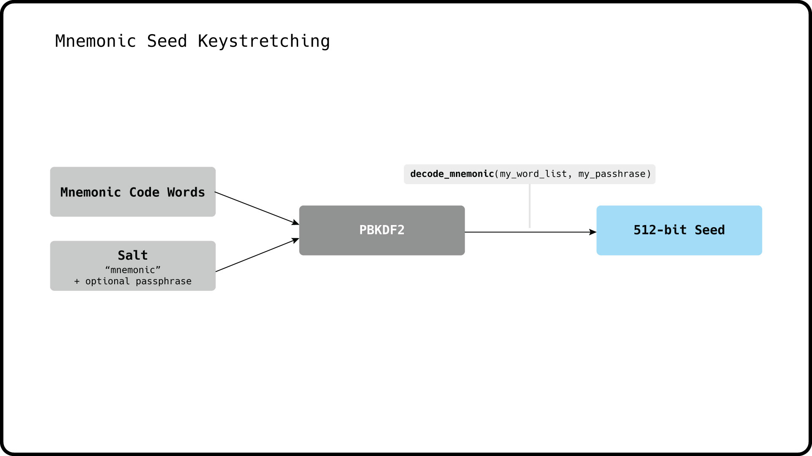
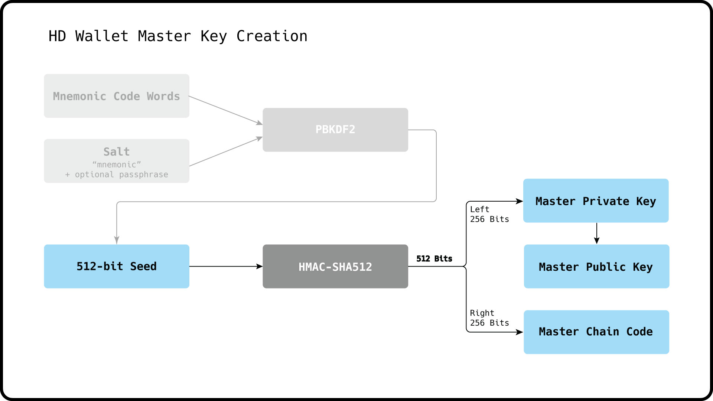
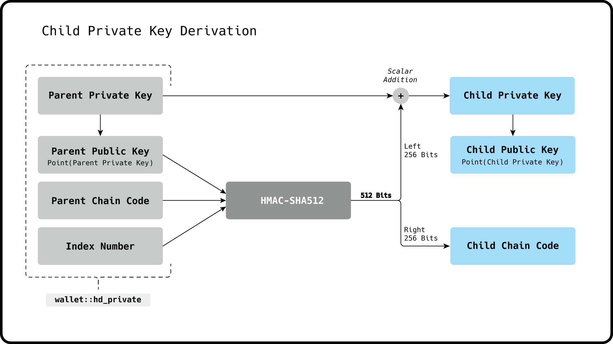
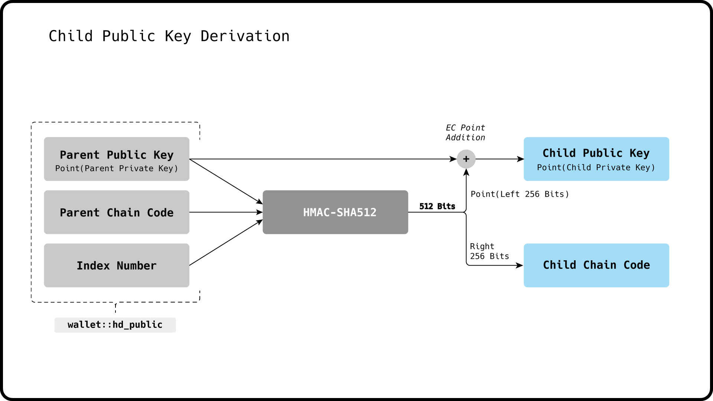
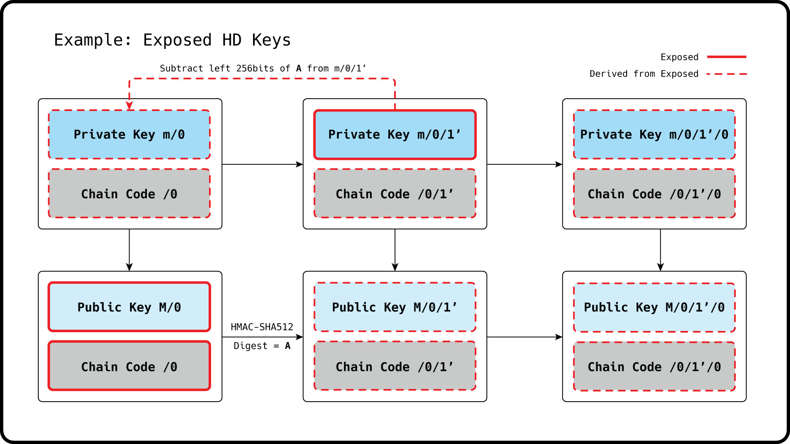
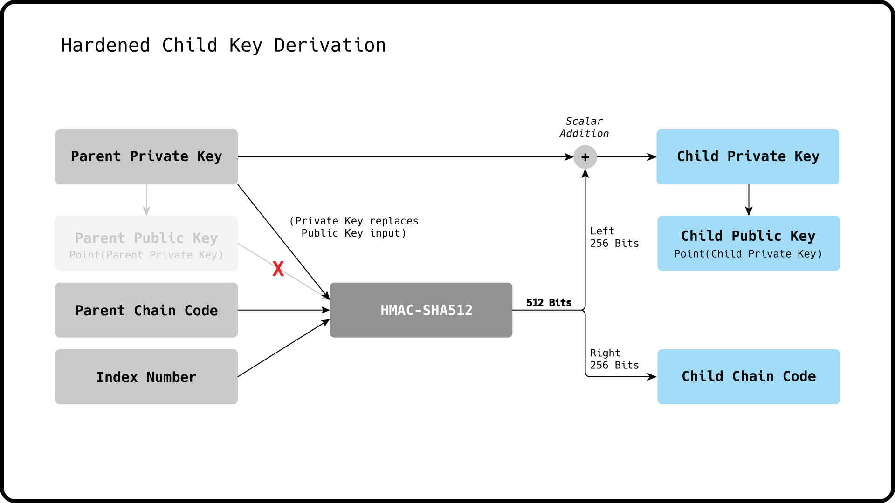
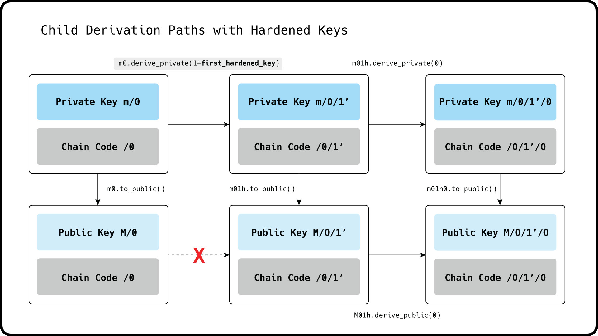

In the previous chapter we illustrated how to create private/public key pairs in Libbitcoin, which were then used to sign/verify transaction messages.

In this chapter, we will cover how to derive publicly shareable Bitcoin addresses, and how to deterministically derive new addresses from existing keys with Hierarchical Deterministic (HD) wallets.

The full example code from this chapter can be found [here](https://github.com/libbitcoin/libbitcoin/wiki/Examples-from-Addresses-and-HD-Wallets)

## Creating a Bitcoin Address
A publicly shareable Bitcoin address is derived from a compressed or uncompressed public key with the additional information of whether it is intended for the Bitcoin mainnet or testnet.

The serialised Bitcoin address consists of:
* 1-Byte **Version Prefix**  
 * Mainnet: 0x00
 * Testnet: 0x6F
* 20-Byte **Hash Digest** (Double Hashed Public Key)
* 4-Byte **Checksum**

The serialised format is encoded in Base58. Note that the public key is hashed in either compressed or uncompressed format, so that this information is later required to recreate a Bitcoin address from a given private key.

Let us create a Bitcoin address in Libbitcoin:
```c++
#include <bitcoin/bitcoin.hpp>
#include <string.h>
#include <iostream>

// Namespace
using namespace bc;
using namespace wallet;
```
<!-- Example 1 -->
```c++
// Begin with a private key
auto my_secret = base16_literal(
    "f3c8f9a6198cca98f481edde13bcc031b1470a81e367b838fe9e0a9db0f5993d");

// Derive pubkey point
ec_compressed my_pubkey;
secret_to_public(my_pubkey, my_secret);

// Pubkeyhash: sha256 + hash160
auto my_pubkeyhash = bitcoin_short_hash(my_pubkey);

// Prefix for mainnet = 0x00
one_byte addr_prefix = { { 0x00 } }; //Testnet 0x6f

// Byte sequence = prefix + pubkey + checksum(4-bytes)
data_chunk prefix_pubkey_checksum(to_chunk(addr_prefix));
extend_data(prefix_pubkey_checksum, my_pubkeyhash);
append_checksum(prefix_pubkey_checksum);

// Base58 encode byte sequence -> Bitcoin Address
std::cout << encode_base58(prefix_pubkey_checksum) << std::endl;

// You can directly generate Bitcoin addresses
// with Libbitcoin wallet types: ec_private/ec_public
// described in the following section
```
<!-- In the next section we will cover Libbitcoin wallet types `ec_private` & `ec_public` feature methods which directly format Bitcoin addresses from secrets and public key points. -->

## A Basic Bitcoin Wallet
Now that we have created a public Bitcoin address from a private key secret, let us consider how a private key can be universally imported & exported from a wallet, independent of implementation, whilst maintaining the ability to derive the publicly shared Bitcoin address.

From the previous example we conclude that following pieces of information are required to create and recreate a specific Bitcoin address:

* Private Key
* Public Key Point Format (compressed or uncompressed)
* Mainnet or Testnet usage

**WIF Private Key Derivation**

The Wallet Import Format (WIF) provides these three pieces of information in a byte sequence.

* 1-Byte **Version Prefix**  
 * Mainnet: 0x80
 * Testnet: 0xEF
* 32-byte **Private Key**
* 1-Byte **Compression Marker**
 * 0x01 or omitted
* 4-Byte **Checksum**


We can now manually create a WIF private key following the preceding schema.  
<!-- Example 1 (part2) -->
```c++
// WIF encoded private key
// Additional Information: Mainnet, PubKey compression
one_byte secret_prefix = { { 0x80 } }; //Testnet Prefix: 0xEF
one_byte secret_compressed = { { 0x01} }; //Omitted if uncompressed

// Apply prefix, suffix & append checksum
auto prefix_secret_comp_checksum = to_chunk(secret_prefix);
extend_data(prefix_secret_comp_checksum, my_secret);
extend_data(prefix_secret_comp_checksum, secret_compressed);
append_checksum(prefix_secret_comp_checksum);

// WIF (mainnet/compressed)
std::cout << encode_base58(prefix_secret_comp_checksum) << std::endl;
```
The WIF can now be easily imported into any new wallet, and provides all the information for its unique Bitcoin address to be derived.  

**Libbitcoin Wallet Types `ec_private`, `ec_public`**

In Libbitcoin, we can use the wallet type `ec_private` to store a private key and necessary information to derive a unique Bitcoin address or export the private key in WIF form.
<!-- Example 1 (part3) -->
```c++
// Instantiate ec_private object
// ec_private::mainnet = 0x8000 (Mainnet Prefixes 0x80,0x00)
// ec_private::testnet = 0xEF6F (Testnet Prefixes 0xEF,0x6F)
ec_private my_private(my_secret, ec_private::mainnet, true);
std::cout << my_private.to_payment_address() << std::endl;
std::cout << my_private.encoded() << std::endl; //WIF private key
```

The `ec_public` type is complementary and holds only following information:
* Public Key Point
* Public Key Point Format (compressed or uncompressed)  

Therefore, this type requires a network (mainnet/testnet) argument in order to produce a Bitcoin address.

<!-- Example 1 (part 4) -->
```c++
// ec_public from ec_private
// (compression implied from ec_private input)
ec_public my_public(my_private);

// ec_public from point
// (compression not implied, supplied as arguments)
ec_public my_public2(my_pubkey, true); //compression = true

// Payment addresses:
// Will always default to mainnet if no argument supplied
// regardless of version in ec_private constructor argument
payment_address my_addr = my_public.to_payment_address();
payment_address my_addr2 = my_public2.to_payment_address(); //0x00, 0x6f
std::cout << (my_addr.encoded() == my_addr2.encoded()) << std::endl;
```

## Mnemonic Code Words

In order to facilitate backups of wallet root secret, mnemonic code words are used so that it can be easily recorded. This secret can range from 128 to 256 bits in 32bit increments, and together with its checksum, can be expressed in a mnemonic word list, with each word representing 11-bits each.

| Secret  Bits  | Checksum Bits | Mnemonic Words |
| ------------- |---------------| ---------------|
| 128           | 4             | 12             |
| 160           | 5             | 15             |
| 192           | 6             | 18             |
| 224           | 7             | 21             |
| 256           | 8             | 24             |

We use the Libbitcoin type `wallet::word_list` to instantiate a mnemonic word list.

<!-- Example 2 (part 1) -->
```c++
// 128, 160, 192, 224, 256 bits of Entropy are valid
// We generate 128 bits of Entropy
data_chunk my_entropy_128(16); //16 bytes = 128 bits
pseudo_random_fill(my_entropy_128);

// Instantiate mnemonic word_list
word_list my_word_list = create_mnemonic(my_entropy_128);
std::cout << join(my_word_list) << std::endl; //join to a single string with spaces
```
The `wallet::word_list` type is simply a type alias of `std::vector<std::string>`, with each element containing a single word of the mnemonic word list.

**Mnemonic Seed: Key Stretching**

This 128 - 256 bit secret encoded by the mnemonic word list can be stretched to 512 bits using the "Password-Based Key Derivation Function 2" (PBKDF2) function, which accepts two parameters: The mnemonic word list and a salt consisting of `"mnemonic"` and an optional passphrase.



We use the `decode_mnemonic(my_word_list, my_passphrase)` method to derive the 512 bit seed, from which we will later create a HD wallet. The passphrase is optional, but increases the cost of brute-force attacks against the mnemonic word list. Note that using an optional secret passphrase will require compiling Libbitcoin with the [ICU option](https://github.com/libbitcoin/libbitcoin/blob/master/README.md).

<!-- Example 3 (part 1) -->
```c++
// Load mnemonic sentence into word list
std::string my_sentence = "market parent marriage drive umbrella custom leisure fury recipe steak have enable";
auto my_word_list = split(my_sentence, " ", true);

// Create an optional secret passphrase
std::string my_passphrase = "my secret passphrase";

// Create 512bit seed (without optional secret passphrase)
auto hd_seed = decode_mnemonic(my_word_list);

// Create 512bit seed (with optional secret passphrase)
// Requires: Libbitcoin compiled with ICU.
// auto hd_seed = decode_mnemonic(my_word_list, my_passphrase);
```

## Hierarchical Deterministic Wallets

Hierarchical deterministic (HD) wallets allow for an arbitrary number of Bitcoin private keys and public keys to be deterministically derived and recreated from a **single HD root seed** controlled by the owner.

This root seed can have a length of 128, 256 or 512 bits. The 512 bit lengthened secret encoded by the mnemonic in the previous section is frequently used as the HD root seed to create a HD wallet.



The 512 bit HD root seed is hashed by the `HMAC-SHA512` algorithm to create a
512 bit digest, which is used split into two separate parts:

* Left 256 bits: Master Private key
* Right 256 bits: Master Chain Code

The master public key is simply derived from the Master private key.

**Libbitcoin HD Wallet Types: `hd_private`, `hd_public`**

Libbitcoin provides us with the `hd_private` type to instantiate the master private key. We can call a `hd_private` method to derive a `hd_public` object which contains the master public key.

<!-- Example 3 (part 2) -->
```c++
// We reuse 512 bit hd_seed from the previous example
// Derivation of master private key m
data_chunk seed_chunk(to_chunk(hd_seed));
hd_private m(seed_chunk, hd_private::mainnet);

// Derivation of master public key M
hd_public M = m.to_public();
```
Both types have methods to derive child keys described in subsequent sections of this chapter.

### Child Private Keys

The `HMAC-SHA512` is used to create child private keys with the following inputs:  
* 256 bit Parent Private Key
* 256 bit Parent Chain Code
* 32 bit Index Number  

The index is incremented to generate additional child private key from the same parent private key.  

*Note that  indices between 0 and 2^31-1 (0x and 0x7FFFFFFF) are used for normal child derivation as described above. Higher indices are reserved for hardened child derivation, which will be covered in a later section in this chapter.*



In Libbitcoin, we can derive create private key or public key children of a `hd_private` object with a given index number.

<!-- Example 3 (part 3) -->
```c++
// Derive children of master key m
auto m0 = m.derive_private(0);
auto m1 = m.derive_private(1);
auto m2 = m.derive_private(2);

// Derive grandchild private keys
auto m10 = m1.derive_private(0); //Depth 2, Index 0
auto m11 = m1.derive_private(1); //Depth 2, Index 1
auto m12 = m1.derive_private(2); //Depth 2, Index 2
auto m100 = m10.derive_private(0); //Depth 3, Index 0
auto m101 = m10.derive_private(1); //Depth 3, Index 1
auto m102 = m10.derive_private(2); //Depth 3, Index 1

// Derive grandchild public keys
auto M00 = m0.derive_public(0); //Depth 2, Index 0
auto M01 = m0.derive_public(1); //Depth 2, Index 1
auto M02 = m0.derive_public(2); //Depth 2, Index 2
// ...

// Derive hd_public of any hd_private object
// of same depth & index
auto M102 = m102.to_public();
```

### Child Public Keys

Due of the associative properties of EC operations, the following can be exploited to derive child public keys directly from parent public keys without the knowledge of any associated private keys.

```c++
//Derivation of child public key
point(child_private_key)
point(parent_private_key + left_256)
point(parent_private_key) + point(left_256)
parent_public_key + point(left_256) //no private key required.
```
So we can now create child public keys with `HMAC-SHA512` with the following inputs:
* 256 bit **Parent Public Key**
* 256 bit **Parent Chain Code**
* 32 bit **Index Number**  



The ability to derive public key descendants of arbitrary depth without the knowledge of the corresponding private keys allows us to derive private and public keys in completely separate environments. The image below shows all the possible derivation paths for HD private and public keys.


Deriving public keys in Libbitcoin is similar to the previous example of child private keys.

<!-- Example 3 (part 4) -->
```c++
// Derive public children of master key M
auto M0 = M.derive_public(0); //Depth 1, Index 0
auto M1 = M.derive_public(1); //Depth 1, Index 1
auto M2 = M.derive_public(2); //Depth 1, Index 2

// Derive further public children
auto M10 = M1.derive_public(0); //Depth 2, Index 0
auto M11 = M1.derive_public(1); //Depth 2, Index 1
auto M12 = M1.derive_public(2); //Depth 2, Index 2
auto M100 = M10.derive_public(0); //Depth 3, Index 0
auto M101 = M10.derive_public(1); //Depth 3, Index 1
// ...

// No private children can be derived
// from child public keys!
```
### Extended Private & Public Keys

All key information required to generate child private and public keys can be serialised in the *extended key format*.

* 4-byte **Version**
 * Private Key: Mainnet(0x0488ADE4)/Testnet(0x04358394 )
 * Public Key: Mainnet(0x0488B21E)/Testnet(0x043587CF )
* 1-byte **Depth**
* 4-byte **Fingerprint of parent**  
 * First 4-bytes of Hash160 (parent pubic key)
* 4-byte **Index Number**
* 32-byte **Parent Chain Code**
* 34-byte **Key**
 * Private Key: 0x00 + 32 bytes private key
 * Public Key: 34 byte compressed public key
* 4-byte **Checksum**

More extended serialisation details can be found in  [BIP32](https://github.com/bitcoin/bips/blob/master/bip-0032.mediawiki).

Let us revisit how we instantiated `hd_private` and `hd_public` previously and understand how all the extended key information is handled in these wallet types.

<!-- Example 4 (part 1) -->
```c++
// Generate master private key
// hd_private::mainnet = 0x0488ADE40488B21E
// Versions for both private and public keys
hd_private m(seed_chunk, hd_private::mainnet);
auto m1 = m.derive_private(1);

// Public key mainnet prefix 0488B21E
// is implicitly passed on to M
hd_public M = m1.to_public();

// Extended Private Key:
// m1 serialised in extended private key format
auto m1_xprv = m.to_hd_key();

// 4 Bytes: Version in hex
auto m1_xprv_ver = slice<0,4>(m1_xprv);
std::cout << encode_base16(m1_xprv_ver) << std::endl;

// 1-Byte: Depth
auto m1_xprv_depth = slice<4,5>(m1_xprv);
std::cout << encode_base16(m1_xprv_depth) << std::endl;

// 4-Bytes: Parent Fingerprint
auto m1_xprv_parent = slice<5,9>(m1_xprv);
std::cout << encode_base16(m1_xprv_parent) << std::endl;

// 4-Bytes: Index Number
auto m1_xprv_index = slice<9,13>(m1_xprv);
std::cout << encode_base16(m1_xprv_index) << std::endl;

// 32-Bytes: Chain Code
auto m1_xprv_chaincode = slice<13,45>(m1_xprv);
std::cout << encode_base16(m1_xprv_chaincode) << std::endl;

// 34-Bytes: Private Key (with 0x00 prefix)
auto m1_xprv_private = slice<45,78>(m1_xprv);
std::cout << encode_base16(m1_xprv_private) << std::endl;

// 4-Bytes: double sha256 checksum
auto m1_xprv_checksum = slice<78,82>(m1_xprv);
std::cout << encode_base16(m1_xprv_checksum) << std::endl;
```
### Hardened Child Keys

In the case that a both the public extended key and a descendent child private key are exposed, it is possible for a malicious actor to derive both the private extended key as well as all descendent children.



To prevent this, a hardened child private key can be derived using the parent private key instead of the parent public key as an input to the `HMAC-SHA512` function.



This breaks the derivation path between a hardened public key and its public key parent.

  

In Libbitcoin, deriving a hardened child private key is implied with the index being set >= 0xFFFFFFFF:
<!-- Example 4 (part 2) -->
```c++
// Hardened private key derivation with index >= 1 << 31
auto m0 = m.derive_private(0);
auto m00h = m.derive_private(hd_first_hardened_key);
auto m01h = m.derive_private(1 + hd_first_hardened_key);
auto m02h = m.derive_private(2 + hd_first_hardened_key);

// Hardened public key can only be derived from private key
auto M00h = m00h.to_public();
// or from parent private key
auto M00h_ = m.derive_public(hd_first_hardened_key);
// Above keys are equivalent
std::cout << (M00h == M00h_) << std::endl;
```
The full example code from this chapter can be found [here](https://github.com/libbitcoin/libbitcoin/wiki/Examples-from-Addresses-and-HD-Wallets)
