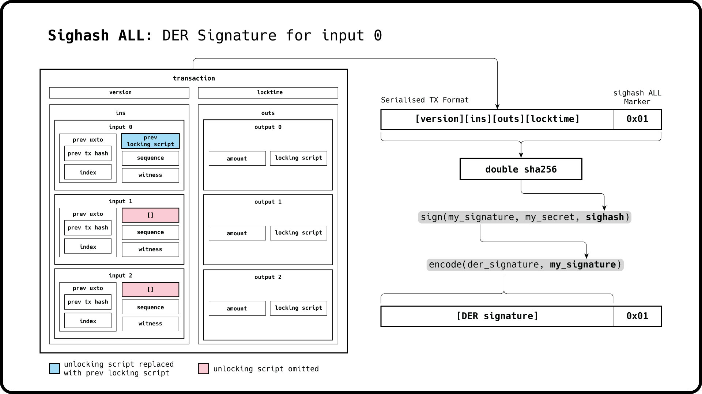
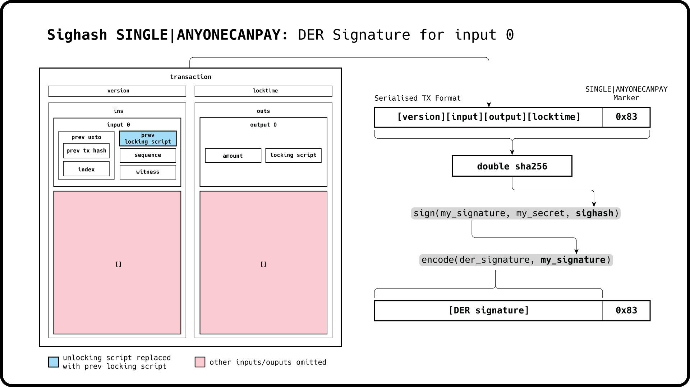

The op_codes `CHECKSIG`, `CHECKSIGVERIFY`, `CHECKMULTISIG`, `CHECKMULTISIGVERIFY` all verify signatures together with an non-script one-byte sighash argument, which indicates which part of the transaction the signature specifically endorses.  

The input signature can endorse an entire transaction with a fixed set of inputs and outputs. The signature can also be selectively applied to specific outputs, so the transaction can include further outputs not endorsed by the signature.

| Sighash Type | Marker | Description| Libbitcoin API |
| -------------|--------| ---------- | -------------- |
| ALL          | 0x01   | Signs all inputs and outputs | `sighash_algorithm::all` |
| NONE         | 0x02   | Signs all inputs, outputs modifiable | `sighash_algorithm::none` |
| SINGLE       | 0x03   | Signs all inputs and single output, other outputs modifiable | `sighash_algorithm::single` |

**Note: Selectively endorsing inputs is done with the `ANYONECANPAY` sighash modifier, which is covered later in this chapter.**

## Sighash ALL

The illustration below illustrates the signature derivation for an input with the sighash set to `ALL`:



Since the entire transaction is included in the sighash that is signed, we must first construct the complete set of inputs and outputs before the signatures are created.

*Note that for each input signing, we place the previous transaction's scriptPubKey or locking script in the scriptSig field of the respective input*

```c++
//Namespace
using namespace bc;
using namespace machine; //opcode
using namespace chain;   //transaction, inputs, outputs, script
```
```c++
// Not shown:
// Construction of inputs and outputs.

// Finalise TX - can't be modified later.
tx.inputs().push_back(input_0);   //first input
tx.inputs().push_back(input_1);   //second input
                                  //...nth input
tx.outputs().push_back(output_0); //first output
tx.outputs().push_back(output_1); //second output
                                  //...nth output

// Construct previous output script of input_0 & input_1.
script prevout_script0 = script::to_pay_key_hash_pattern(my_address0.hash());
script prevout_script1 = script::to_pay_key_hash_pattern(my_address1.hash());

// TX signature for input_0.
endorsement sig_0;
uint8_t input0_index(0u);
script::create_endorsement(sig_0, my_secret0, prevout_script0, tx,
    input0_index, sighash_algorithm::all);

// TX signature for input_1.
endorsement sig_1;
uint8_t input1_index(1u);
script::create_endorsement(sig_1, my_secret1, prevout_script1, tx,
    input1_index, sighash_algorithm::all);

// Construct input script_0.
operation::list sig_script_0;
sig_script_0.push_back(operation(sig_0));
sig_script_0.push_back(operation(to_chunk(pubkey0)));
script input_script0(sig_script_0);

// Construct input script_1.
operation::list sig_script_1;
sig_script_1.push_back(operation(sig_1));
sig_script_1.push_back(operation(to_chunk(pubkey1)));
script input_script1(sig_script_1);

// Add unlockingscript to TX.
tx.inputs()[input0_index].set_script(input_script0);
tx.inputs()[input1_index].set_script(input_script1);

// ALL: We cannot modify TX after signing.
```
We then verify the input scripts and the included endorsements. If necessary, you can consult the documentation chapters on [script verification](https://github.com/libbitcoin/libbitcoin/wiki/Script-Verification) and [the script machine](https://github.com/libbitcoin/libbitcoin/wiki/Script-Machine).
```c++
witness empty_witness;      // Only verified in a p2w tx.
uint64_t prevout_amount(1); // Only verified in a p2w endorsement.

// Verify input script (and endorsement) for input 0.
auto ec_input0 = script::verify(tx, input0_index,rule_fork::all_rules,
      input_script0, empty_witness, prevout_script0,
      prevout_amount);
// Success.
std::cout << ec_input0.message() << std::endl;

// Verify input script (and endorsement) for input 1.
auto ec_input1 = script::verify(tx, input1_index,rule_fork::all_rules,
      input_script1, empty_witness, prevout_script1,
      prevout_amount);
// Success.
std::cout << ec_input1.message() << std::endl;
```


## Sighash NONE

Signing an input with the sighash marker set to `NONE` omits all outputs in the sighash which is signed.


We can therefore modify any output after the input signatures are created.

```c++
// Not shown:
// Construction of inputs and outputs.

// We only need to finalise inputs. Outputs can be modified after signing.
tx.inputs().push_back(input_0);   //first input
tx.inputs().push_back(input_1);   //second input
                                  //...nth input

// Construct previous output script of input_0 & input_1
script prevout_script0 = script::to_pay_key_hash_pattern(my_address0.hash());
script prevout_script1 = script::to_pay_key_hash_pattern(my_address1.hash());

// TX signature for input_0.
endorsement sig_0;
uint8_t input0_index(0u);
script::create_endorsement(sig_0, my_secret0, prevout_script0, tx,
    input0_index, sighash_algorithm::none);

// TX signature for input_1.
endorsement sig_1;
uint8_t input1_index(1u);
script::create_endorsement(sig_1, my_secret1, prevout_script1, tx,
    input1_index, sighash_algorithm::none);

// Construct input script_0.
operation::list sig_script_0;
sig_script_0.push_back(operation(sig_0));
sig_script_0.push_back(operation(to_chunk(pubkey0)));
script input_script0(sig_script_0);

// Construct input script_1.
operation::list sig_script_1;
sig_script_1.push_back(operation(sig_1));
sig_script_1.push_back(operation(to_chunk(pubkey1)));
script input_script1(sig_script_1);

// Add unlockingscript to TX.
tx.inputs()[input0_index].set_script(input_script0);
tx.inputs()[input1_index].set_script(input_script1);

// NONE: We can modify all outputs after signing
tx.outputs().push_back(output_0); //first output
tx.outputs().push_back(output_1); //second output
                                  //...nth output

witness empty_witness;      // Only verified in a p2w tx.
uint64_t prevout_amount(1); // Only verified in a p2w endorsement.

// Verify input script (and endorsement) for input 0.
auto ec_input0 = script::verify(tx, input0_index,rule_fork::all_rules,
      input_script0, empty_witness, prevout_script0,
      prevout_amount);

// Success.
std::cout << ec_input0.message() << std::endl;

// Verify input script (and endorsement) for input 1.
auto ec_input1 = script::verify(tx, input1_index,rule_fork::all_rules,
      input_script1, empty_witness, prevout_script1,
      prevout_amount);

// Success.
std::cout << ec_input1.message() << std::endl;
```

## Sighash SINGLE

A signature with the sighash marker set to `SINGLE` will only endorse or fix a single output with the same index as the input being signed. All other outputs can be modified later.


In the following example, we will sign a transaction with 2 inputs and 2 outputs, but add further outputs later on.
<!-- Example 3 -->
```c++
// Not shown:
// Construction of inputs and outputs.


// We sign all inputs and single output with same index.
tx.inputs().push_back(input_0);   //first input
tx.outputs().push_back(output_0); //first output
tx.inputs().push_back(input_1);   //second input
tx.outputs().push_back(output_1); //second output
                                  //...nth input
                                  //...nth output

// Construct previous output scripts of input_0 & input_1.
script prevout_script0 = script::to_pay_key_hash_pattern(my_address0.hash());
script prevout_script1 = script::to_pay_key_hash_pattern(my_address1.hash());

// TX signature for input_0.
endorsement sig_0;
uint8_t input0_index(0u);
script::create_endorsement(sig_0, my_secret0, prevout_script0, tx,
      input0_index, sighash_algorithm::single);

// TX signature for input_1.
endorsement sig_1;
uint8_t input1_index(1u);
script::create_endorsement(sig_1, my_secret1, prevout_script1, tx,
      input1_index, sighash_algorithm::single);

// Construct input script_0.
operation::list sig_script_0;
sig_script_0.push_back(operation(sig_0));
sig_script_0.push_back(operation(to_chunk(pubkey0)));
script input_script0(sig_script_0);

// Construct input script_1.
operation::list sig_script_1;
sig_script_1.push_back(operation(sig_1));
sig_script_1.push_back(operation(to_chunk(pubkey1)));
script input_script1(sig_script_1);

// Add unlockingscript to TX.
tx.inputs()[input0_index].set_script(input_script0);
tx.inputs()[input1_index].set_script(input_script1);

// SINGLE: We can add additional outputs after signing.
tx.outputs().push_back(output_2); //third output
                                  //...nth output

witness empty_witness;      // Only verified in a p2w tx.
uint64_t prevout_amount(1); // Only verified in a p2w endorsement.

// Verify input script (and endorsement) for input 0.
auto ec_input0 = script::verify(tx, input0_index,rule_fork::all_rules,
      input_script0, empty_witness, prevout_script0,
      prevout_amount);

// Success.
std::cout << ec_input0.message() << std::endl;

// Verify input script (and endorsement) for input 1.
auto ec_input1 = script::verify(tx, input1_index,rule_fork::all_rules,
      input_script1, empty_witness, prevout_script1,
      prevout_amount);

// Success.
std::cout << ec_input1.message() << std::endl;
```  

## Sighash Modifier: ANYONECANPAY

The sighash modifier `ANYONECANPAY` enables inputs to be modified after signing, and can be combined with the previous sighash markers.

| Sighash Type            | Marker | Description | Libbitcoin API |
| ------------------------|--------| ------------| -------------- |
| ALL + ANYONECANPAY      | 0x81   | Signs single input and all outputs, inputs modifiable | `sighash_algorithm::all_anyone_can_pay` |
| NONE + ANYONECANPAY     | 0x82   | Signs single input, inputs & outputs modifiable | `sighash_algorithm::none_anyone_can_pay` |
| SINGLE + ANYONECANPAY   | 0x83   | Signs single input, and single output, other inputs & outputs modifiable | `sighash_algorithm::single_anyone_can_pay` |

The following image illustrates the signature derivation for an input set to `SINGLE|ANYONECANPAY`



**Sighash Example: NONE|ANYONECANPAY**  

We construct a transaction with a `NONE|ANYONECANPAY` input signature below:

```c++
  // Not shown:
  // Construction of inputs and outputs.

  // We only sign a single input.
  tx.inputs().push_back(input_0);

  // Construct previous output script of input_0.
  script prevout_script0 = script::to_pay_key_hash_pattern(my_address0.hash());

  // TX signature for input_0.
  endorsement sig_0;
  uint8_t input0_index(0u);
  script::create_endorsement(sig_0, my_secret0, prevout_script0, tx,
      input0_index, none_anyone_can_pay);

  // Construct input script_0.
  operation::list sig_script_0;
  sig_script_0.push_back(operation(sig_0));
  sig_script_0.push_back(operation(to_chunk(pubkey0)));
  script input_script0(sig_script_0);

  // Add unlockingscript to TX.
  tx.inputs()[input0_index].set_script(input_script0);

  // ANYONECANPAY: We can modify other inputs after signing.
  // Important: input added here must include valid input script!
  // ...and previously be signed with tx index = 1
  tx.inputs().push_back(input_1);   //second input
                                    //...nth input

  // NONE: We can modify all outputs after signing.
  tx.outputs().push_back(output_0); //first output
  tx.outputs().push_back(output_1); //second output
                                    //...nth output

  witness empty_witness;      // Only verified in a p2w tx.
  uint64_t prevout_amount(1); // Only verified in a p2w endorsement.

  // Verify input script (and endorsement) for input 0.
  auto ec_input0 = script::verify(tx, input0_index,rule_fork::all_rules,
        input_script0, empty_witness, prevout_script0,
        prevout_amount);

  // Success.
  std::cout << ec_input0.message() << std::endl;

  // Verify input script (and endorsement) for input 1.
  auto ec_input1 = script::verify(tx, input1_index,rule_fork::all_rules,
        input_script1, empty_witness, prevout_script1,
        prevout_amount);

  // Success.
  std::cout << ec_input1.message() << std::endl;
```  
You can find the entire chapter example code [here](https://github.com/libbitcoin/libbitcoin/wiki/Examples-from-Sighash-and-Partial-Transaction-Signing).
